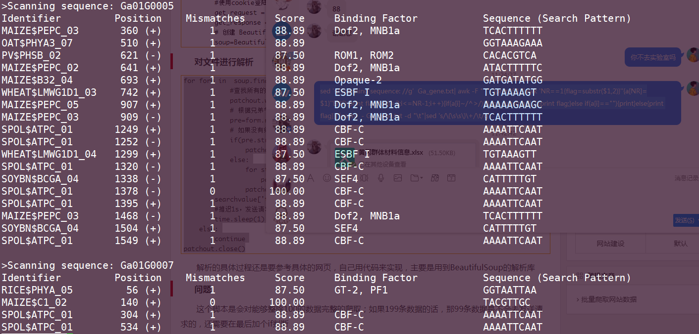

## 转录因子结合位点预测

> 今天想要分析转录因子结合位点的数据，使用http://gene-regulation.com/cgi-bin/pub/programs/patch/bin/patch.cgi网站进行预测，但由于该网站不提供文件上传的功能，同时每次进行处理的数据量有上限，想到我又得点击几百次鼠标的操作就头大；于是参考别人的博客写下一个爬虫

脚本地址（./patch.tar.gz)

**用法**

依赖python3，需要安装tqdm第三方库用于显示进度条

```shell
//第一步使用login.py获取cookie文件
python3 login.py >cookie.txt
//第二步使用patch.py文件进行POSt请求爬取数据
python patch.py 基因fasta序列文件 输出结果文件
```

​	:warning:<span style="color:red">注意的是patch.py文件中需要指定cookie.txt文件的路径</span>

+ ### :jack_o_lantern: 首先使用python库urllib、http.cookiejar来登录网站

  ```python
  import urllib.error, urllib.request, urllib.parse
  import http.cookiejar
  
  LOGIN_URL = 'http://gene-regulation.com/login'
  values = {'user':'账号','password':'密码'}
  postdata = urllib.parse.urlencode(values).encode()
  user_agent = r'Mozilla/5.0 (Macintosh; Intel Mac OS X 10_13_3) AppleWebKit/537.36' \
               r' (KHTML, like Gecko) Chrome/61.0.3163.79 Safari/537.36'
  headers = {'User-Agent':user_agent, 'Connection':'keep-alive'}
  #将cookie保存在本地，并命名为cookie.txt
  cookie_filename = 'cookie.txt'
  cookie_aff = http.cookiejar.MozillaCookieJar(cookie_filename)
  handler = urllib.request.HTTPCookieProcessor(cookie_aff)
  opener = urllib.request.build_opener(handler)
  
  request = urllib.request.Request(LOGIN_URL, postdata, headers)
  try:
      response = opener.open(request)
  except urllib.error.URLError as e:
      print(e.reason)
  
  cookie_aff.save(ignore_discard=True, ignore_expires=True) 
  # 保存信息到cookie中
  ```

+ ###  :checkered_flag:使用cookie文件信息进行登录

  ```python
  #get_url为使用cookie所登陆的网址，该网址必须先登录才可
  get_url = 'http://gene-regulation.com/cgi-bin/pub/programs/patch/bin/patch.cgi'
  # 使用cookie文件进行登录
  cookie_filename = 'cookie.txt'
  cookie_aff = http.cookiejar.MozillaCookieJar(cookie_filename)
  cookie_aff.load(cookie_filename,ignore_discard=True,ignore_expires=True)
  handler = urllib.request.HTTPCookieProcessor(cookie_aff)
  opener = urllib.request.build_opener(handler)
  #构造请求头，伪装成浏览器
  user_agent = r'Mozilla/5.0 (Macintosh; Intel Mac OS X 10_13_3) AppleWebKit/537.36' \
               r' (KHTML, like Gecko) Chrome/61.0.3163.79 Safari/537.36'
  headers = {'User-Agent':user_agent, 'Connection':'keep-alive'}
  # 构造post请求post表单
  searchvalue={"Status": "First",
  			'searchName':'default',
  				'usr_seq':'default',
  				"seqStat": "DEL",
  				'sequenceName':'default.seq',
  				"site_opt": "OUR",
  				'group':'plants',
  				'minLen': 8,
  				'mismatch':1,
  				'penalty':100,
  				'boundary':87.5}
  #初始化序列信息
  searchvalue['theSequence']=''
  ```

+ ### :carousel_horse:关于post请求如何查看键值对

  

+ ### :diamond_shape_with_a_dot_inside: ​开始从文件中读取数据进行post请求

  ```python
  #读取基因序列信息，赋值给字典				
  genelist=fastaread(sys.argv[1])
  #创建输出文件句柄
  patchout=open(sys.argv[2],'w')
  # 用于记录序列数目
  flag=0
  # 循环添加序列信息
  for gene in tqdm(genelist.keys(),desc="request is doing"):
  	flag+=1
  	#拼接字符串操作
  	searchvalue['theSequence']='%s%s%s%s%s%s' % (searchvalue['theSequence'],">",gene," \n",genelist[gene],"\n")
  	# 每隔200个序列发起一次请求，但是最后还会剩下不能够整除200的一些序列
  	if(flag%200==0):
  		# 对post内容进行编码
  		searchtdata = urllib.parse.urlencode(searchvalue).encode()
  		#使用cookie登陆get_url
  		get_request = urllib.request.Request(get_url,searchtdata,headers=headers)
  		get_response = opener.open(get_request)
  		# 创建 BeautifulSoup对象
  		soup=BeautifulSoup(get_response.read().decode(),features="html.parser")
  		#BeautifulSoup 解析说明文档https://www.crummy.com/software/BeautifulSoup/bs4/doc.zh
  		for form in  soup.find_all("form",action="/cgi-bin/pub/programs/patch/bin/files.cgi"):
  			#查找所有的提交表单
  			if(form.previous_sibling.previous_sibling.previous_sibling.string!=None):
  				patchout.write(">"+form.previous_sibling.previous_sibling.previous_sibling.string+"\n")
  			else:
  				print("当前的"+flag+"存在没有的结果！")
  			# 根据兄弟节点获得每个序列id和结果信息
  			pre=form.next_sibling.next_sibling
  			# 如果没有结果，它的string就为no result find
  			if(pre.string!=None):
  				patchout.write(pre.string+"\n")
  			else:
  				for string in pre.strings:
  					patchout.write(string)
  				patchout.write("\n")
  		searchvalue['theSequence']=''
  		#推迟1s，发送请求
  		time.sleep(1);
  		# 当只剩下最后89不能够满足整除的条件时
  	elif(flag==len(genelist)):
  		# 对post内容进行编码
  		searchtdata = urllib.parse.urlencode(searchvalue).encode()
  		#使用cookie登陆get_url
  		get_request = urllib.request.Request(get_url,searchtdata,headers=headers)
  		get_response = opener.open(get_request)
  		# 创建 BeautifulSoup对象
  		soup=BeautifulSoup(get_response.read().decode(),features="html.parser")
  		#BeautifulSoup 解析说明文档https://www.crummy.com/software/BeautifulSoup/bs4/doc.zh
  ```

  

+ ### :bride_with_veil:对HTML文件进行解析

  ```python
  for form in  soup.find_all("form",action="/cgi-bin/pub/programs/patch/bin/files.cgi"):
  			#查找所有的提交表单
  			patchout.write(">"+form.previous_sibling.previous_sibling.previous_sibling.string+"\n")
  			# 根据兄弟节点获得每个序列id和结果信息
  			pre=form.next_sibling.next_sibling
  			# 如果没有结果，它的string就为no result find
  			if(pre.string!=None):
  				patchout.write(pre.string+"\n")
  			else:
  				for string in pre.strings:
  					patchout.write(string)
  				patchout.write("\n")
  		searchvalue['theSequence']=''
  		#推迟1s，发送请求
  		time.sleep(1);
  	else:
  		continue
  patchout.close()
  ```

  ***

  

  ***

  

+ 将解析得到的网络文件，转化为一定的格式

  ```bash
  sed 's/Scanning sequence: //g'  Ga_gene.txt| awk -F "  " '{print $1}'|awk 'NR==1{flag=substr($1,2)}'
  '{a[NR]=$1}'
  'END{
  	print flag;
  	for(i=2;i<=NR-1;i++){
  	if(a[i]~/^>/){
  		flag=substr(a[i],2);
  		print flag;}
  	else if(a[i]==""){
  			print}
  	else{
  	print flag
  		}}}'|paste  - Ga_gene.txt -d "\t"|sed 's/\(\s\s\)\+/\t/g'
  
  ```

+ ### 转换格式后的文件

  

  

  

  

  